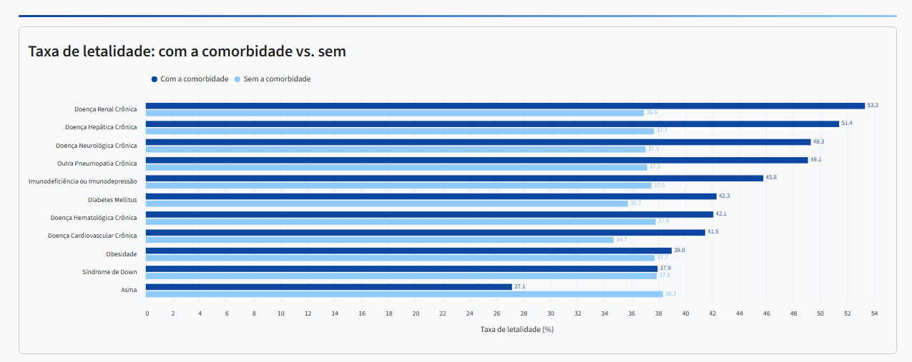
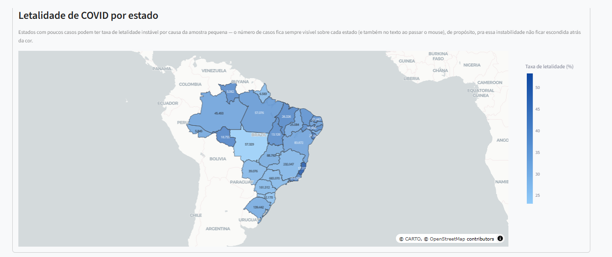
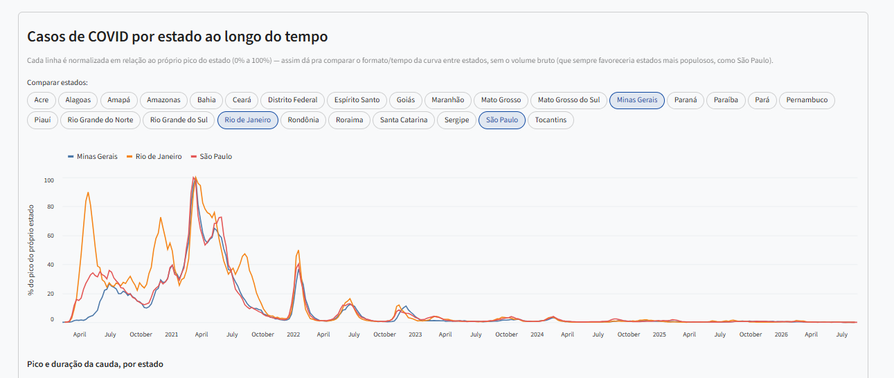

# Letalidade de COVID-19 por Comorbidade — Brasil

Pipeline de ETL (extração, tratamento e carga) e dashboard interativo que analisa a
**taxa de letalidade de COVID-19 por comorbidade, por estado e ao longo do tempo no
Brasil**, usando dados reais do SIVEP-Gripe (Ministério da Saúde).

## Print do dashboard


Taxa de letalidade por comorbidade — comparação entre quem tem e quem não tem cada condição.


Mapa coroplético do Brasil com a taxa de letalidade de COVID-19 por estado.


Comparação da curva de casos entre estados ao longo do tempo, normalizada pelo pico de cada um.

## O que este projeto faz

- Baixa os bancos de dados oficiais do SIVEP-Gripe (2020 a 2026) direto do OpenDataSUS.
- Filtra só os casos confirmados de COVID-19 dentro do banco de SRAG (Síndrome
  Respiratória Aguda Grave, que inclui outras causas além de COVID).
- Calcula a taxa de letalidade (óbitos ÷ (óbitos + curas), entre casos com desfecho
  conhecido) para 11 comorbidades, comparando quem tinha a condição com quem não tinha.
- Calcula a mesma taxa por estado e ao longo do tempo (semanal).
- Apresenta tudo num dashboard interativo (Streamlit): gráficos de barras, linha do
  tempo, mapa coroplético do Brasil por estado, e uma tabela explorável por comorbidade.

## Fonte dos dados

**SIVEP-Gripe** (Sistema de Informação da Vigilância Epidemiológica da Gripe), que
registra casos de Síndrome Respiratória Aguda Grave (SRAG) no Brasil. Dado bruto
disponibilizado pelo Ministério da Saúde através do
[OpenDataSUS](https://opendatasus.saude.gov.br/). Período coberto: 2020 a 2026 (2026 é
um ano parcial). Os contornos geográficos dos estados vêm da
[API oficial do IBGE](https://servicodados.ibge.gov.br/).

A metodologia completa (definição exata da taxa de letalidade e as limitações
identificadas) está documentada dentro do próprio dashboard, na seção
"Sobre este projeto / Metodologia".

## Como instalar e rodar

Estas instruções assumem que você nunca viu este projeto antes e está começando do zero.

> **Só quer ver o dashboard funcionando?** Os passos 5, 6 e 7 são **opcionais**.
> Os dados já processados (e o contorno geográfico dos estados) vêm prontos dentro
> do repositório, então você pode pular direto do passo 4 pro passo 8. Esses três
> passos só são necessários se você quiser gerar os dados novamente do zero — o que
> baixa ~4,9 GB de dados brutos do SIVEP-Gripe e pode demorar bastante.

### 1. Pré-requisitos

- Python 3.11 ou mais recente instalado ([python.org](https://www.python.org/downloads/)).
- Uns 6 GB de espaço livre em disco (os dados brutos baixados somam ~4,9 GB).

### 2. Baixar o projeto e entrar na pasta

```bash
git clone https://github.com/gustavocduarte/covid-letalidade-comorbidade.git
cd covid-letalidade-comorbidade
```

### 3. Criar e ativar um ambiente virtual

Um ambiente virtual isola as bibliotecas deste projeto do resto do seu sistema.

```bash
python -m venv .venv
```

Ativar (escolha o comando do seu sistema):

```bash
# Windows (PowerShell)
.venv\Scripts\Activate.ps1

# Windows (Git Bash) / Linux / macOS
source .venv/Scripts/activate   # Git Bash no Windows
source .venv/bin/activate       # Linux / macOS
```

### 4. Instalar as dependências

```bash
pip install -r requirements.txt
```

### 5. Rodar o pipeline de dados (extração + tratamento + carga) — opcional

*Pule para o passo 8 se você só quer ver o dashboard funcionando com os dados que já
vêm prontos no repositório.*

Isso baixa os 7 anos de dados brutos do SIVEP-Gripe (~4,9 GB no total — pode demorar
dependendo da sua internet) e gera os arquivos processados usados pelo dashboard. Os
CSVs brutos ficam salvos permanentemente em `data/raw/`, então esse download só
acontece uma vez.

```bash
python src/pipeline.py
```

### 6. Baixar o contorno geográfico dos estados (pro mapa) — opcional

```bash
python src/baixar_geojson.py
```

### 7. Gerar a série semanal de casos por estado — opcional

```bash
python src/gerar_serie_estado.py
```

### 8. Rodar o dashboard

```bash
streamlit run src/dashboard.py
```

Abra **http://localhost:8501** no navegador.

### Rodar os testes automatizados (opcional)

O pytest não está em `requirements.txt` (só é necessário pra rodar os testes, não
pro dashboard em si), então instale-o primeiro:

```bash
pip install pytest
```

Depois, rode:

```bash
pytest
```

## Estrutura de pastas

```
covid-letalidade-comorbidade/
├── data/
│   ├── raw/          # CSVs brutos do SIVEP-Gripe, um por ano (gerado pelo passo 5)
│   ├── processed/    # Dados já tratados, usados pelo dashboard (gerado pelos passos 5-7)
│   └── geo/          # Contorno geográfico dos estados em GeoJSON (gerado pelo passo 6)
├── docs/             # Dicionário de dados oficial do SIVEP-Gripe (PDF) e texto extraído
├── src/
│   ├── extract.py              # E do ETL: baixa os CSVs brutos do OpenDataSUS
│   ├── transform.py            # T do ETL: filtra COVID, calcula taxas de letalidade
│   ├── load.py                 # L do ETL: salva os resultados em data/processed/
│   ├── pipeline.py             # Orquestra E-T-L pros 7 anos, um de cada vez
│   ├── baixar_geojson.py       # Baixa e verifica o contorno dos 27 estados (API do IBGE)
│   ├── gerar_serie_estado.py   # Gera a série semanal de casos por estado
│   └── dashboard.py            # O dashboard Streamlit em si
├── tests/
│   └── test_transform.py       # Testes automatizados (pytest) da lógica principal
├── conftest.py                 # Configuração do pytest (deixa src/ importável nos testes)
├── requirements.txt
└── README.md
```

## Notas técnicas

- O mapa por estado usa `plotly.express.choropleth_map` (renderização via WebGL/MapLibre)
  em vez de `choropleth` (SVG) ou do Altair — foi a solução encontrada pra um problema de
  renderização de mapas SVG complexos identificado durante o desenvolvimento neste
  ambiente específico.
- O campo de tabagismo (`TABAG`) existe no formulário oficial do SIVEP-Gripe, mas não é
  preenchido na prática pelos postos de saúde — por isso não entra na análise.
- Ferramentas de desenvolvimento (Ruff para lint, pytest para testes) não estão em
  `requirements.txt` por não serem necessárias pra rodar o dashboard em si; instale-as
  separadamente (`pip install ruff pytest`) se for contribuir com o projeto.
